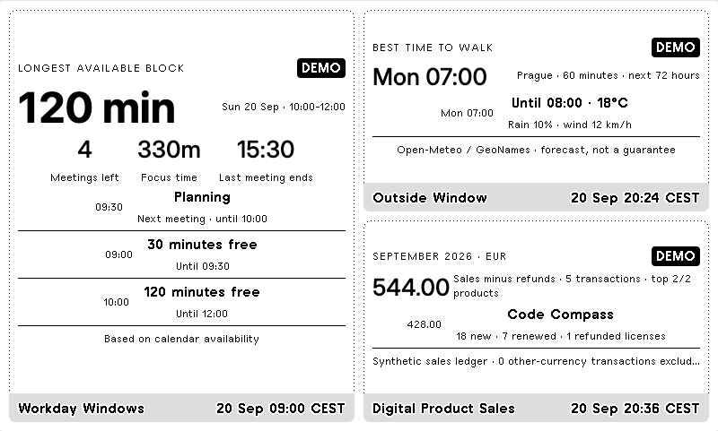
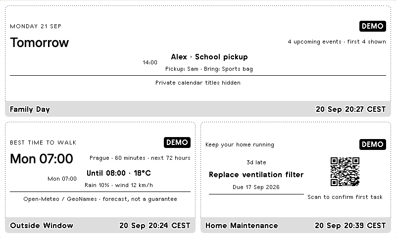
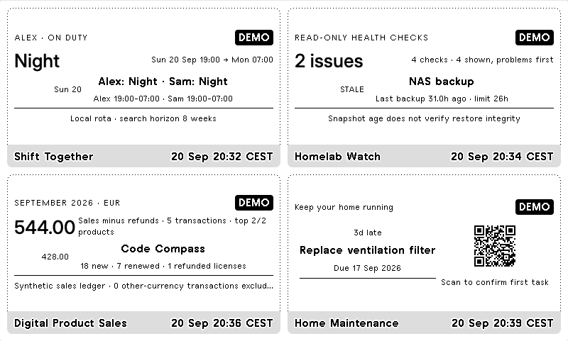
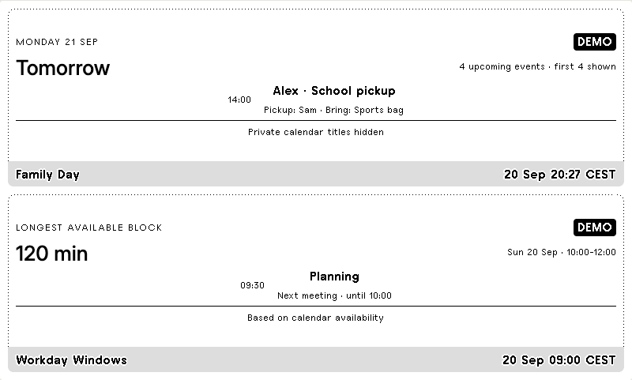

# Shared-screen options

Use native **TRMNL Mashups** to display two, three or four of the independent
plugins together. Each plugin keeps its own repository, installation, data
collector and webhook. The TRMNL playlist combines their views.

## Try the preview

Open [`index.html`](index.html) on GitHub, choose **Download raw file**, and open
the downloaded HTML file in a browser. Alternatively, clone this repository and
open `docs/mashups/index.html` locally. GitHub's file viewer shows source code;
it does not run the preview.

The preview has four presets, five layout choices and a plugin selector for every
panel. It contains only synthetic demo snapshots, needs internet access for the
TRMNL framework and fonts, and does not connect to or change a TRMNL account.
Selections are temporary. On a narrow browser window, scroll the display
horizontally to inspect the original 800 × 480 layout.

## Recommended presets

| Preset | Layout | Panel assignments |
| --- | --- | --- |
| Workday | Left half + two right quarters | Left: Workday Windows; top right: Outside Window; bottom right: Digital Product Sales |
| At home | Top half + two bottom quarters | Top: Family Day; bottom left: Outside Window; bottom right: Home Maintenance |
| Four-plugin overview | Four quarters | Top left: Shift Together; top right: Homelab Watch; bottom left: Digital Product Sales; bottom right: Home Maintenance |
| Two calendars | Two horizontal halves | Top: Family Day; bottom: Workday Windows |

### Workday



### At home



### Four-plugin overview



### Two calendars



For the original 800 × 480 display, we recommend two to four panels for
readability. Rotate several combined screens in the playlist to cover all seven
plugins. Larger devices have additional options; consult the official
[Mashups guide](https://help.trmnl.com/en/articles/10168132-mashups) for device support.

## Create a screen in your TRMNL account

1. Install and configure each desired plugin from its own repository. Send data
   to each installed instance using that plugin's collector and webhook.
2. Open **Playlists**, then the dropdown beside **Add Plugin**. Select the layout
   corresponding to the preset above.
3. Select a connected plugin for each section, matching the positions in TRMNL's
   layout diagram.
4. Refresh the playlist and enlarge its generated thumbnail to inspect the result.
   Hide redundant full-screen entries if you only want the combined screen.
5. Keep the individual collectors running on their usual schedules. Check every
   panel's update timestamp and inspect the result on your actual device.

To undo the arrangement, restore the individual full-screen playlist entries.
Account and device refresh settings still apply. A collector must send fresh data
before its panel can show it; the mashup does not synchronise the collectors or
turn them into live feeds. See the current
[refresh rules](https://help.trmnl.com/en/articles/10113695-how-refresh-rates-work).

## Choose the right amount of detail

| Plugin | Recommended use | Plugin-specific guide |
| --- | --- | --- |
| Outside Window | Quarter for the best outdoor window; larger panel for more forecast rows | [Guide](https://github.com/JirakJ/trmnl-outside-window/blob/main/docs/MASHUPS.md) |
| Family Day | Horizontal half for a wide heading and next event; inspect long headings in vertical halves | [Guide](https://github.com/JirakJ/trmnl-family-day/blob/main/docs/MASHUPS.md) |
| Workday Windows | Vertical half for meeting metrics and free time | [Guide](https://github.com/JirakJ/trmnl-workday-windows/blob/main/docs/MASHUPS.md) |
| Shift Together | Quarter for the current shift; larger panel for more rows | [Guide](https://github.com/JirakJ/trmnl-shift-together/blob/main/docs/MASHUPS.md) |
| Homelab Watch | Quarter for the issue count and first check | [Guide](https://github.com/JirakJ/trmnl-homelab-watch/blob/main/docs/MASHUPS.md) |
| Digital Product Sales | Quarter for monetary net sales and first product; larger panel for aggregate license metrics | [Guide](https://github.com/JirakJ/trmnl-digital-product-sales/blob/main/docs/MASHUPS.md) |
| Home Maintenance | Quarter for the first task and QR; vertical half for two tasks | [Guide](https://github.com/JirakJ/trmnl-home-maintenance/blob/main/docs/MASHUPS.md) |

Small views deliberately show fewer rows. Their summary may describe more items
than are visible. Long text is clamped or wraps; check your own titles and values.
The demo maintenance QR points to a non-working example address. Real confirmation
links must be reachable from the phone used to scan the physical display.

## Implementation and verification

The plugins already contain `full.liquid`, `half_vertical.liquid`,
`half_horizontal.liquid` and `quadrant.liquid`. TRMNL supplies the surrounding
mashup and view containers when a layout is configured. No combined backend,
shared credentials or changes to the collectors are required. See the
[framework layout reference](https://trmnl.com/framework/docs/3.3/mashup).

The interactive preview embeds rendered demo fragments from those templates.
[`sources.json`](sources.json) records their source commits. These are snapshots,
not live imports: changing a plugin does not automatically change this preview.
To refresh them, build the seven standalone repositories in sibling directories
and run `npm run update:mashups` here. This reads only `_build` demo HTML; never
replace it with private account exports or real data. Then run:

```sh
npm ci
npx playwright install chromium
npm run check:mashups
```

With installed Google Chrome, `CHROME_CHANNEL=chrome npm run check:mashups` is
also supported. `UPDATE_MASHUP_SCREENSHOTS=1 npm run check:mashups` refreshes the
four screenshots after deliberate snapshot changes.

The checks render the presets, verify panel bounds and overlap, exercise the
layout and plugin selectors, and decode the demo QR where present. The
recommended presets have also been visually inspected in Chromium. Account
import, private data integration and physical e-ink display operation have not
been verified. The HTML preview is not a TRMNL import ZIP.
