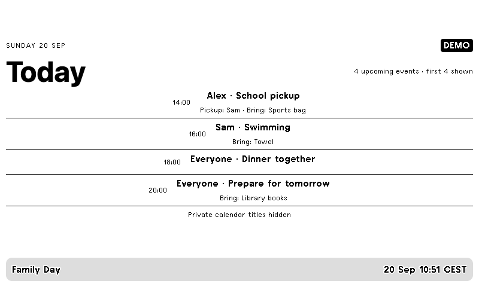

# Family Day / Dnes u nás doma



One family agenda with named calendars, pickup responsibility and things to bring.
After the configured hour it displays tomorrow. It shows the first five upcoming
events; smaller layouts show fewer. Private event titles and notes are hidden by default.

Follow the [installation guide](../../README.md), use `config.example.json` and run:

```sh
.venv/bin/python -m everyday family --config private/family.json --push
```

Set `FAMILY_ICS_URL` locally to your HTTPS ICS subscription URL. Add more calendar
entries with their own names and environment variables, or use `{"name":"Family",
"file":"family.ics"}`. Relative paths are resolved beside your configuration.
Local ICS exports only update when you replace the file.

Outlook/Teams events can be read through an Outlook ICS subscription where your
organization permits it. Google, Apple and other ICS providers work as well.
This is an ICS integration, not Microsoft OAuth. Never publish a calendar publicly
just to bypass your organization's restrictions. Recurrence, EXDATE, event overrides,
all-day events and calendar time zones are handled by `recurring-ical-events`.

Add description lines `Pickup: Alex` and `Bring: Sports bag`, or configure an
assignment matched to the exact event title. Other description text is not sent.
If any feed fails, no partial agenda is pushed; the previous screen remains with
its original update time. Remove sources explicitly if you no longer need them.

Tests cover recurrence exclusions, cancellation, private titles and evening rollover.
