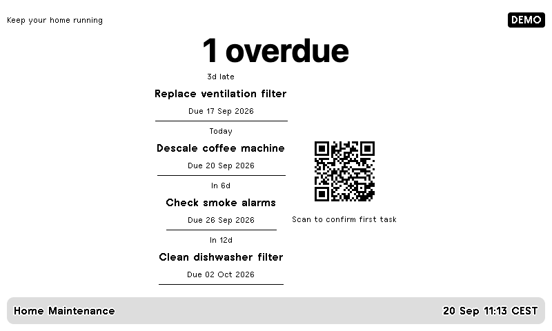

# Home Maintenance

Recurring tasks sorted by due date, with a QR code for confirming the first task.
Completion is stored in a local SQLite database; the next interval starts on the
actual completion date. No cloud account is needed beyond TRMNL.



1. Copy `config.example.json` to `private/maintenance.json` and replace the example
   tasks and `last_done` dates with your own. Each task needs a stable unique `id`,
   a `name`, and exactly one positive integer `interval_days` or `interval_months`.
   Month intervals clamp to the final day when necessary (January 31 → February 28).
2. Set `confirmation_base_url` to the origin reachable from your phone, without a
   trailing path, e.g. your home server's private hostname. The example loopback URL
   only works on the computer running the service. `allow_http: true` is for a trusted
   local network; use HTTPS through your own reverse proxy/VPN for remote access.
3. Start the confirmation service using the **same configuration and database**:

   ```sh
   .venv/bin/python -m everyday.maintenance_server --config private/maintenance.json
   ```

   It binds to `127.0.0.1:8765` by default. For direct LAN access, explicitly pass
   `--host` with the server's LAN IP. For an HTTPS proxy, keep the loopback bind and
   preserve the configured Host header. Use your OS service manager to keep it running.
4. Follow the [root installation guide](../../README.md) to import `maintenance.zip`.
   Run and schedule the collector:

   ```sh
   .venv/bin/python -m everyday maintenance --config private/maintenance.json --push
   ```

Scan the QR code, check the task's name and press **Mark completed today**. Merely
opening/scanning the link does not complete it. The next scheduled collector run
updates the display and shows the next task. You can confirm tasks early. Smaller
layouts show fewer upcoming tasks, but still include the confirmation code.

## State and private links

The database overrides the initial `last_done` value after a completion. Keep IDs
stable; back up `private/maintenance.sqlite3` to preserve completion dates. To correct an
initial date after a recorded completion, stop the service, back up the database,
and update that task's `completed.day` locally. There is no public task-management API.

Links are randomly generated, task-scoped capabilities lasting seven days. The
database stores their hashes, and completing a task invalidates all its outstanding
links. Changing a task's settings invalidates its older links too. Confirmation
requires a same-session form token and rejects cross-origin submissions. Responses
are not cached, do not send referrers to other origins, and cannot be embedded in another site.

The QR image contains a private confirmation link. Anyone with the current QR code
and network access can confirm that task; keep real device screenshots private.
TRMNL receives its encoded QR pixels. QR generation happens locally without an
external image service. The SQLite file is created with owner-only permissions on
Unix. Restrict access to its directory as well. Do not expose this household service
directly to the public internet. Demo QR codes deliberately use `example.invalid`
and cannot change real task state.

This service does not perform maintenance or determine manufacturer intervals.
Configure intervals appropriate to your equipment.
