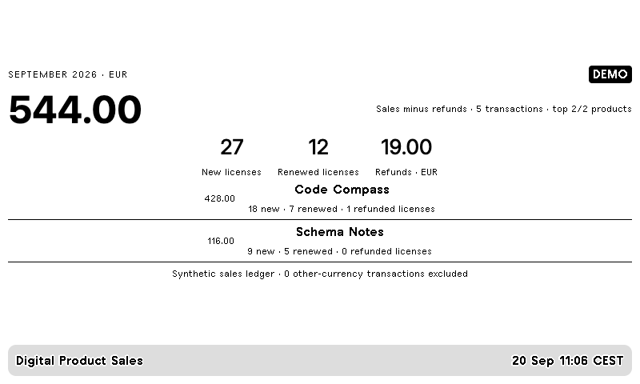

# Digital Product Sales

Month-to-date sales minus refunds, new licenses, renewed licenses and the top three
products. Each instance displays exactly one currency. No exchange-rate assumptions.

Copy `config.example.json` into `private/sales.json` and put your CSV next to it as
`private/sales.csv`. Run `python -m everyday sales --config private/sales.json`.
Import `sales.zip` and add `--push` after configuring its webhook as described in the
[root guide](../../README.md). Refresh the CSV export to obtain new sales data;
running the collector does not download sales reports automatically.

## CSV contract

`example.csv` is **synthetic documentation**, not a real report. Required fields:

| Field | Meaning |
| --- | --- |
| `id` | Stable, unique transaction-line ID; one order with several product lines needs distinct IDs |
| `date` | ISO date or timestamp; dates without a UTC offset use the configured timezone |
| `product` | Product name |
| `type` | NEW, RENEW or REFUND by default |
| `licenses` | Positive integer number of purchased, renewed or refunded licenses |
| `amount` | Total line amount, using a decimal point and no thousands separator |
| `currency` | Three uppercase letters, such as EUR |

Map your export's headers using `columns`; set `delimiter`, optional `date_format`
(Python `strptime` syntax) and `types` as needed. Type mappings must resolve to `new`,
`renew` or `refund`. For a single-product export without a product column, add a
constant product column before import. Add missing license counts from the source;
do not confuse transaction count with license count. Unknown types fail visibly.

Exact duplicate IDs are counted once; conflicting duplicates fail the import.
Refund amounts may be positive or negative and always reduce the balance. New and
renewal counts are purchase counts before refunds, which appear separately by
product. Refunds belong to the month of the refund transaction. Future transactions
are excluded. Other currencies are excluded and counted in the footer. Optionally
set `products` to an array of exact product names. File modification time indicates
the local file's freshness, not guaranteed provider data freshness.

Decimal arithmetic avoids binary rounding errors. `money_decimals` controls display
rounding (default 2; use 0 for JPY, 3 for KWD); it never converts currencies. This is
a sales summary, not a payout, profit or accounting reconciliation.

## JetBrains Marketplace

The [official sales report](https://plugins.jetbrains.com/docs/marketplace/sales-report.html)
offers a full CSV export and distinguishes NEW/RENEW transactions and license
counts. Its amount includes JetBrains commission and uses the customer's currency.
Inspect your actual CSV headers and map/normalize them to this contract. No private
JetBrains export has been tested, and no automatic Marketplace sales API connection
is claimed. Customer names, addresses and other unused columns never reach TRMNL.
