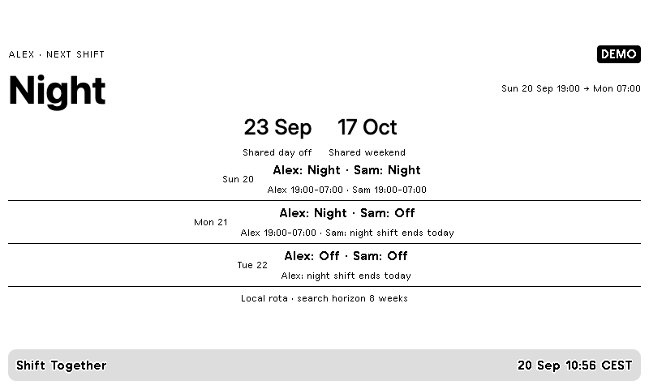

# Shift Together / Směny a společné volno



Repeating rotas for up to four people, date-specific overrides and shared days off.
Overnight shifts remain active after midnight. A day after a night shift is not
reported as a full day off. It searches eight weeks for the next shared day and weekend.

Follow the [installation guide](../../README.md), copy `config.example.json`, then:

```sh
.venv/bin/python -m everyday shifts --config private/shifts.json --push
```

`anchor` is the date of the first cycle entry. `cycle` repeats forward and backward.
Define each code under `shifts`: `null` means no shift, otherwise provide local
`start` and `end` times. An end earlier than the start means the following day.
`exceptions` replaces the shift on an exact date, for example holidays or swaps.
All people share the configured IANA time zone. Codes and names should be short
to fit small displays. No external data service or API key is required for computation.

The upcoming-days list groups shifts by their starting date. A carry-over night shift
is also noted on the following day. Tests cover carry-over, exceptions, dates before
the cycle anchor and a night spanning a daylight-saving transition.
