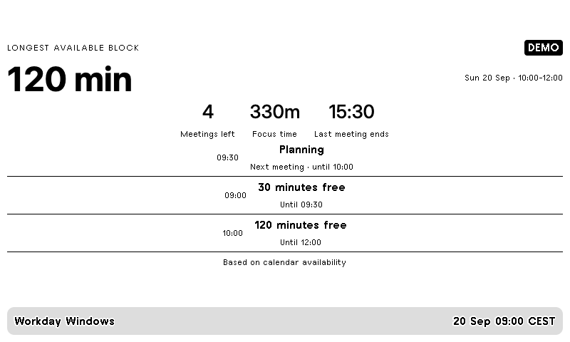

# Workday Windows / Můj pracovní den



Your longest uninterrupted work block, next meeting, remaining focus time and the
end of your final meeting. Overlapping appointments are merged before free time is
calculated. All-day busy events block the day; transparent/free events do not.
After work and on non-working days it looks ahead to the next working day.

Follow the [installation guide](../../README.md), copy `config.example.json`, then:

```sh
.venv/bin/python -m everyday workday --config private/workday.json --push
```

Set `WORK_ICS_URL` locally to an HTTPS Outlook/Google/Apple ICS feed. As with
[Family Day](../family), `file` can reference an exported ICS file. Teams events
come from the corresponding Outlook calendar. This release does not request
Microsoft OAuth permissions or bypass tenant sharing restrictions. Local exports
need to be refreshed by their owner.

`work_days`: Monday is 0, Sunday is 6. `work_start` and `work_end` must be within
the same local day; use Shift Together for overnight work. `minimum_free_minutes`
sets the smallest useful gap. Focus time totals only gaps meeting that threshold.
Calendar status is not a real-time Teams presence indicator.

`hide_titles: true` sends only availability, never event names. Private titles are
hidden independently by `hide_private`. No descriptions or join links are sent.
The demo is a labelled sample workday at 09:00, independent of your actual agenda.

Tests cover nested/overlapping meetings, all-day blocks, free events and weekends.
